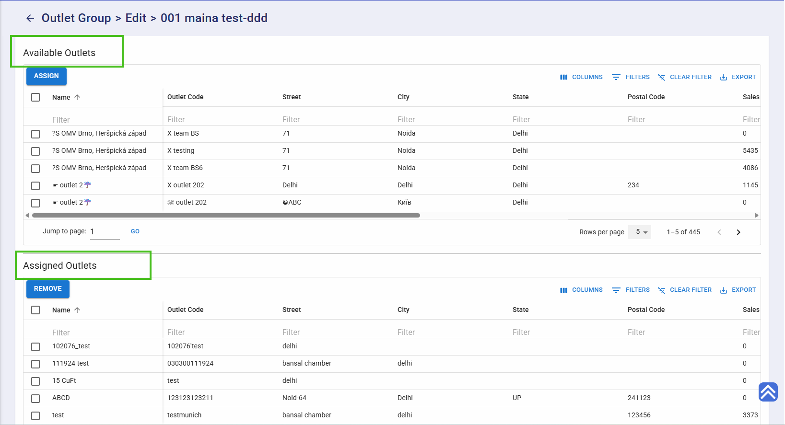
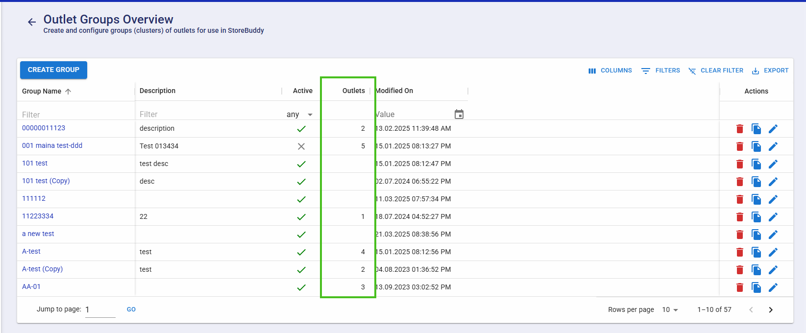
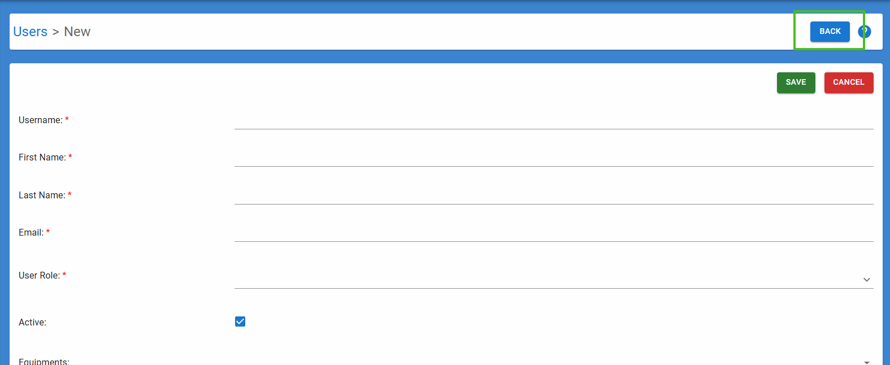
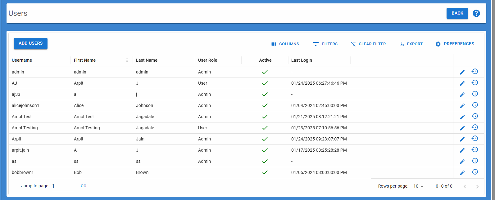
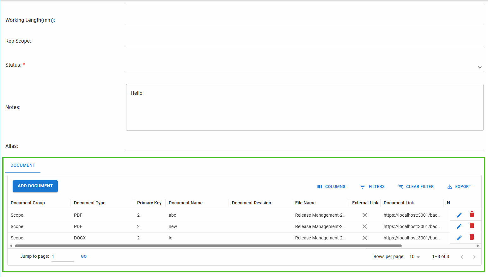
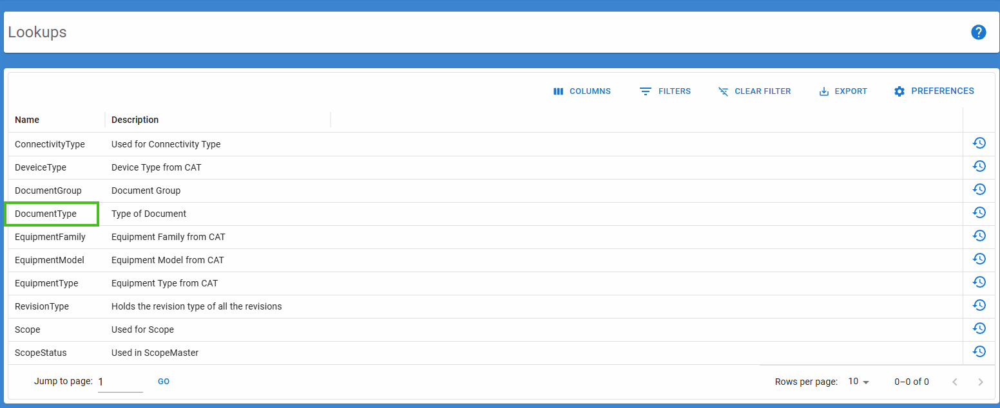
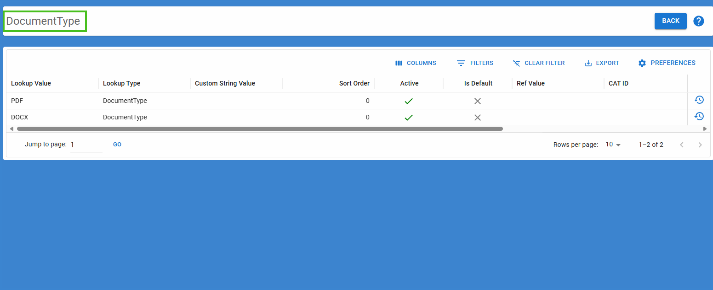
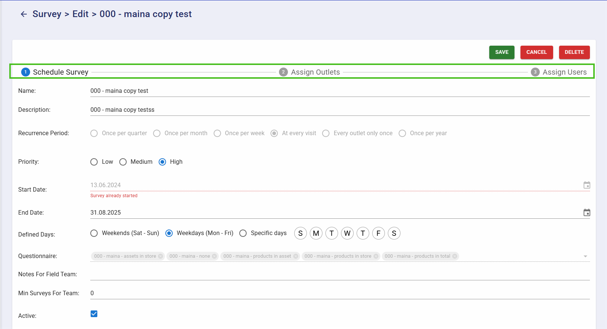

# How we will use the durlabh/dframework-ui

In Dframework we have create Multple Component for our Use

**1:** SnackBar
**2:** Dialog
**3:** Grid
**4:** ChildGrid

**Example:** \***\*\*\*\*\***\*\*\***\*\*\*\*\***\*\*\*\*\***\*\*\*\*\***\*\*\***\*\*\*\*\*** Example of SnackBar \***\*\*\*\*\***\*\*\***\*\*\*\*\***

# How we will use the SnackBar Component

## frist import in your Index.js folder of your Project

```js
import React from "react";
import { SnackbarProvider } from "@durlabh/dfamework-ui";
export default function App() {
  return (
    <SnackbarProvider SnackbarProps={{ autoHideDuration: 1000 }}>
      ******************* Import Your Component ********************
    </SnackbarProvider>
  );
}
```

## Then use in Your Project

```js
import React from "react";
import { useSnackbar } from "@durlabh/dfamework-ui";
export default function App() {
  const snac = useSnackbar();
  return (
    <div>
      <Button
        variant="contained"
        color="primary"
        onClick={() =>
          snac.showMessage("An error occured, please try after some time.")
        }
      >
        Show Snackbar
      </Button>
    </div>
  );
}
```

**Example:** \***\*\*\*\*\***\*\*\***\*\*\*\*\***\*\*\*\*\***\*\*\*\*\***\*\*\***\*\*\*\*\*** Example of Dialog \***\*\*\*\*\***\*\*\***\*\*\*\*\***

# How we will use the Dialog Component

```js
import {DialogComponent} from '@durlabh/dfamework-ui';
import React from 'react'
import
export default function App() {
  return (
    <div>
       <DialogComponent open={true}  onCancel={false} title="Confirm Delete"  children ="Are you sure you want to delete "/>
    </div>
  )
}
```

**Example:** \***\*\*\*\*\***\*\*\***\*\*\*\*\***\*\*\*\*\***\*\*\*\*\***\*\*\***\*\*\*\*\*** Example of Grid \***\*\*\*\*\***\*\*\***\*\*\*\*\***

# Example of Grid

```js
import React from "react";
import { UiModel } from "./lib/components/Grid/ui-models";
export default function App() {
  const surveyModel = new UiModel({
    title: "Questionnaires",
    defaultSort: "SurveyTypeName ASC",
    linkColumn: "SurveyTypeName",
    api: "SurveyType",
    idProperty: "id",
    columns: [
      {
        field: "id",
        type: "number",
        flex: 1,
        gridLabel: "User Id",
        label: null,
        pinned: "right"
      },
      { field: "title", type: "string", gridLabel: "User Post Id", flex: 1 },
      {
        field: "Completed",
        type: "boolean",
        gridLabel: "Completion Status",
        flex: 1
      }
    ]
  });
  return (
    <div>
      <surveyModel.Grid />
    </div>
  );
}
```

# Example of ChildGrid of Grid

```js
import React from "react";
import { UiModel } from "./lib/components/Grid/ui-models";
export default function App() {
  const surveyModel = new UiModel({
    title: "Questionnaires",
    defaultSort: "SurveyTypeName ASC",
    linkColumn: "SurveyTypeName",
    api: "SurveyType",
    idProperty: "id",
    columns: [
      {
        field: "id",
        type: "number",
        flex: 1,
        gridLabel: "User Id",
        label: null,
        pinned: "right"
      },
      { field: "title", type: "string", gridLabel: "User Post Id", flex: 1 },
      {
        field: "Completed",
        type: "boolean",
        gridLabel: "Completion Status",
        flex: 1
      }
    ]
  });
  return (
    <div>
      <surveyModel.ChildGrid />
    </div>
  );
}
```

# Properties of UiModel

## UiModel Configuration Properties

| **Property**           | **Type**            | **Description**                                                                                                                                                                                                                                                                                                                                                                                                                                                                    | **Defaults to**   | **Required** |
| ---------------------- | ------------------- | ---------------------------------------------------------------------------------------------------------------------------------------------------------------------------------------------------------------------------------------------------------------------------------------------------------------------------------------------------------------------------------------------------------------------------------------------------------------------------------- | ----------------- | ------------ |
| `title`                | `string`            | The title of the grid.                                                                                                                                                                                                                                                                                                                                                                                                                                                             | -                 | Yes          |
| `columns`              | `array`             | The list of column definitions for the grid.  [Column Properties Table](#column-properties-table)                                                                                                                                                                                                                                                                                                                                                                                  | -                 | Yes          |
| `formTitle`            | `string`            | Title used in the form layout.                                                                                                                                                                                                                                                                                                                                                                                                                                                     | `title`           | No           |  | `title` | No |
| `gridSubTitle`         | `string`            | Subtitle displayed below the grid title.                                                                                                                                                                                                                                                                                                                                                                                                                                           | -                 | No           |
| `api`                  | `string`            | The API endpoint to fetch grid data.                                                                                                                                                                                                                                                                                                                                                                                                                                               | `title`           | No           |
| `idProperty`           | `string`            | Specifies the unique identifier for grid rows.                                                                                                                                                                                                                                                                                                                                                                                                                                     | `api\|\|title`    | No           |
| `defaultSort`          | `string`            | Specifies the default sort order for the grid data. <br> `Example:- defaultSort: "ModifiedOn Desc" ` for sorting by ModifiedOn in descending order.                                                                                                                                                                                                                                                                                                                                    | `ModifiedOn DESC` | No           |
| `paginationMode`       | `server \| client`  | Determines the pagination mode for the grid. When set to `client`, all data is loaded at once, and pagination happens on the client side. When set to `server`, data is fetched page by page from the server.                                                                                                                                                                                                                                                                      | `server`          | No           |
| `defaultFilters`       | `array`             | Sets the default filters applied to the grid. <br> Example: `defaultFilters: [{ "field": "StatusDate", "operator": "after", "value": "2024-09-01" }]`                                                                                                                                                                                                                                                                                                                              | -                 | No           |
| `showHeaderFilters`    | `boolean`           | Displays header filters on grid columns.                                                                                                                                                                                                                                                                                                                                                                                                                                           | `true`            | No           |
| `readOnly`             | `boolean`           | When `readOnly` is enabled, users won’t be able to open the edit form by double-clicking on the grid, and the action buttons will be hidden.                                                                                                                                                                                                                                                                                                                                       | `false`           | No           |
| `joinColumn`           | `string`            | Specifies the column used for joining data with a parent grid.                                                                                                                                                                                                                                                                                                                                                                                                                     | -                 | No           |
| `standard`             | `object \| boolean` | The standard property defines which audit columns appear in the grid. If set to true, all sub-properties will be true; if set to false, all sub-properties will be false. If the user wishes to customize this behavior by enabling or disabling certain columns, they can pass an object. Each key represents a column, which is enabled when set to true and hidden when set to false. See the [Standard Property Columns Table](#standard-property-columns-table ) for details. | `true`            | No           |
| `controllerType`       | `string`            | Specifies the type of controller. Use "cs" for a .NET API. If no value is provided, it defaults to a Node.js API.                                                                                                                                                                                                                                                                                                                                                                  | Node.js API       | No           |
| `exportTemplate`             | `string`            | Template configuration name for exporting, templates are stored inside `emailTemplates` directory at root of the project. eg. `exportTemplate: "alert-notification"`                                                                                                                                                                                                                                                                                                                                                                                                                                            | -                 | No           |
| `pivotApi`             | `string`            | API endpoint for pivot-specific data.                                                                                                                                                                                                                                                                                                                                                                                                                                              | -                 | No           |
| `preferenceId`         | `string`            | Identifier for saved grid preferences.                                                                                                                                                                                                                                                                                                                                                                                                                                             | -                 | No           |
| `defaultPreferenceEnums` | `object`            | Enumerations for specific table preferences. [Table Preference Enums Example](./docs/defaultPreferenceEnums.md)                                                                                                                                                                                                                                                                                                                                                                | -                 | No           |
| `showAddIcon`          | `boolean`           | Indicates if the "Add" button icon should be displayed.                                                                                                                                                                                                                                                                                                                                                                                                                            | `false`            | No           |
| `addUrlParamKey`       | `string`            | Key for additional URL parameters when navigating to forms. [View Example](#addurlparamkey-and-searchparamkey-example)                                                                                                                                                                                                                                                                                                                                                             | -                 | No           |
| `searchParamKey`       | `string`            | Key to be used from the URL parameters of the current route, which should be shown as the page title for the next route. [View Example](#addurlparamkey-and-searchparamkey-example)                                                                                                                                                                                                                                                                                                | -                 | No           |
| `initialValues`        | `object`            | Initial values for form fields. eg. `{ StudentName: 1 }`                                                                                                                                                                                                                                                                                                                                                                                                                                                   | {}                 | No           |
| `applyFieldConfig`     | `function`          | A function used to apply custom field configurations, such as disabling a date field. [View Example](#1-applyfieldconfig-column-property)                                                                                                                                                                                                                                                                                                                                        | -                 | No           |
| `relations`            | `array`             | Defines the relationship configurations for related grids. </br>[View Example](#relations-example)                                                                                                                                                                                                                                                                                                                                                                                 | -                 | No           |
| `exportFormats`        | `object`            | The `exportFormats` object controls the visibility of different export formats in the UI. Each key in `exportFormats` represents a file format (CSV, Excel, XML, HTML, or JSON), and its value determines whether the corresponding export option is available. [View Example](#exportformats)                                                                                                                                                                                     | `{ excel: true,  csv: true, xml: true, html: true, json: true}`            | No           |
| `customActions`        | `array`             | An array of custom action objects to add custom buttons to the grid's action column. Each object should have an `action` (string), `icon` (string, see note below), and `onClick` (function) handler. The `onClick` function receives an object with `{ row, navigate }`. | -                 | No           |

### Navigation Properties 
| **Property**       | **Type**  | **Description**                                                                                                                                                                                                                                                | **Defaults to**                           |
| ------------------ | --------- | -------------------------------------------------------------------------------------------------------------------------------------------------------------------------------------------------------------------------------------------------------------- | ----------------------------------------- |
| `linkColumn`       | `string`  | The linkColumn makes a specific DataGrid column clickable, triggering actions like navigation, edit, or delete. For delete actions, it sets the record's name (from the `linkColumn`) and ID, preparing for deletion confirmation.                             | -                                         | `title` |
| `allowDoubleClick` | `boolean` | Controls whether double-clicking on rows is enabled. When set to `true`, users can double-click a row to trigger an action, such as opening a detailed view or editing the row. If `false`, double-clicking will have no effect.                               | `true`                                    |
| `permissions`      | `object`  | Permissions for grid actions, including adding, editing, deleting, and exporting data all property is true by default.[View Example](#Permissions)   | `{ add: true, edit: true, delete: true, export: true }` |
| `showHistory`      | `boolean` | Controls whether the history icon is displayed in the action column. When `true`, the history icon is shown; when `false`, it is hidden.                                                                                                                       | `true`                                    |
| `rowRedirectLink`  | `string`  | URL to redirect to when a row is clicked. If empty, nothing happens when the user clicks on the row.                                                                                                                                                           | ""                                        |
| `navigateBack`         | `string\|function\|boolean`  | Controls both the visibility and behavior of the back button on the Form and Grid. <br>When set to `true`, the back button is shown and will navigate to the previous route.<br>When set to a **string**, it navigates to the specified static path. <br>When set to a **function**, it receives `{ params, searchParams, data }` and returns a dynamic path for navigation.[View Example](#navigateBack-example)                                                                                                                                                                                                                                                                                                                                  | `false`                 |


## Column Properties

| **Property**       | **Type**                   | **Description**                                                                                                                                                                  | **Defaults to** | **Required** |
|--------------------|----------------------------|----------------------------------------------------------------------------------------------------------------------------------------------------------------------------------|-----------------|--------------|
| `field`            | `string`                   | Specifies the name of the field displayed in the column. This property is used to map the column to the corresponding data field, enabling the grid to display the correct data. | -               | `Yes`      |
| `label`            | `string \| null`           | Displays the column name in both the form and the grid. If set to null, the column will be hidden from the form.                                                                 | `field`         | `Yes`       |
| `type`             | `string`                   | Specifies the type of data in the column (e.g., `number`, `string`). [Detail View](#field-components-properties-table)                                                                                                              | -               | `Yes`      |
| `gridLabel`        | `string \| null`           | The label displayed as the column header in the grid, or set to null to hide the column from the grid.                                                                          | `label`         | `No`       |
| `pinned`           | `string`                   | Determines whether the column is pinned (frozen) to one side of the grid, allowing it to remain visible while scrolling horizontally. Accepts values like `left` or `right`.                                                                                                                                | `left`          | `No`       |
| `sortable`         | `boolean`                  | Specifies if the column can be sorted. This is MUI DataGrid property.                                                                                                            | `true`          | `No`       |
| `filterable`       | `boolean`                  | Specifies if the column can be filtered. This is MUI DataGrid property.                                                                                                          | `true`          | `No`       |
| `editable`         | `boolean`                  | Indicates if the cells in the column are editable.                                                                                                                               | `false`         | `No`       |
| `tab`              | `string`                   | Specifies the tab associated with this column in a tabbed layout.                                                                                                                | -               | `No`       |
| `required`         | `boolean`                  | Indicates if this column is required in the form.                                                                                                                                | `false`         | `No`       |
| `hide`             | `boolean`                  | Hides the column from the grid.                                                                                                                                                  | `false`         | `No`       |
| `renderCell`       | `function`                 | Custom function to render cell content in a MUI Data Grid. Receives `{ row, value, field }` as arguments and returns a React element for custom cell rendering.                 | -               | `No`       |
| `align`            | `string`                   | Specifies text alignment for the column of grid (`left`, `center`, `right`).                                                                                                     | `left`          | `No`       |
| `tooltip`          | `string`                   | Tooltip to display on hover over the column header.                                                                                                                              | -               | `No`       |
| `width`            | `number`                   | Specifies the width of the column in pixels.                                                                                                                                     | -               | `No`       |
| `resizable`        | `boolean`                  | Indicates if the column width can be resized by the user.                                                                                                                        | `true`          | `No`       |
| `readOnly`         | `boolean`                  | Marks the column as read-only. When true, the form field becomes disabled.                                                                                                       | `false`         | `No`       |
| `min`              | `string \| number \| date` | Sets the minimum value. For strings and numbers, it acts as a `min` limit. For dates, it functions as `minDate`.   For adding dynamin validation based on form-field, value should be passed as `{fieldName}`.                                                              | -               | `No`       |
| `max`              | `string \| number \| date` | Sets the maximum value. For strings and numbers, it acts as a `max` limit. For dates, it functions as `maxDate`. For adding dynamin validation based on form-field, value should be passed as `{fieldName}`.                                          | -               | `No`       |
| `multiSelect`      | `boolean`                  | Enables multiple selections. Specific to type [select](#2-type-select).                                                                                                          | `false`         | `No`       |
| `parentComboField` | `string`                   | Field name used to fetch dependent data for a `Select` field.                                                                                                                    | -               | `No`       |
| `lookup`           | `string` / `array`         | Defines the lookup source for dropdown values in the column. Specific to type [select](#2-type-select).                                                                          | -               | `No`       |
| `variant`          | `string`                   | Specifies the variant for fields (e.g., standard, filled). These are MUI variants.                                                                                               | `standard`      | `No`       |
| `multiline`        | `boolean`                  | Indicates if the text field should support multiple lines. Specific to type [string](#3-type-string--password).                                                                  | `false`         | `No`       |
| `rows`             | `number`                   | Number of rows to display in a multiline text field. Specific to type [string](#3-type-string--password).                                                                        | `5`               | `No`       |
| `isUtc`            | `boolean`                  | Indicates if the field value is stored in UTC format.                                                                                                                            | `false`         | `No`       |
| `placeHolder`      | `string`                   | To show `placeHolder` only for type [select](#2-type-select).                                                                                                                    | -               | `No`       |
| `config`      | `string`                   | To Specify configuration for the dynamic columns.       | -               | Required for `dynamic` type      |
| `limitTags`      | `string`                   | To Specify number of tags to be shown in autocomplete (while not in focus). Specific to type [autocomplete](#10-type-autocomplete).       | 5              | Required for `dynamic` type      |


# **Field Components Properties Table**

You can use these components by defining the type in the **Properties** column.

## **Field Types**

### 1. **Type: `boolean`**

Represents a **Checkbox** component.

- Allows true, false values.
- **`disabled`** (boolean): Determines whether the checkbox is interactive.
  - When `disabled` is set to `true`, users cannot change the checkbox value.
- Example: `{ "type": "boolean", "required": true | false, "field": "IsActive", "label": "Active ?" }`

---

### 2. **Type: `select`**

Represents a **Select** component.

- Defines the lookup source for dropdown values in the column.
- Example: `{ "type": "select", "required": true, lookup: 'scopetype' }`, // load select data from 'scopetype' lookup.
  `{ "type": "select", lookup: [{value: 1, label: "Apple"}, {value: 2, label: "Mango"}] }`, // loads data from static array of values
    `{ "type": "select", lookup: "students", multiSelect: true }` //implements a multi-select
---

### 3. **Type: `string | password | email`**

Represents a **TextField** component, with different behaviors depending on the specified `type`:

#### Common Features

- The `variant` (string) property defines the input style:
  - `standard` (default): underline only
  - `filled`: solid background
  - `outlined`: bordered

---

#### `string` specific features

- **`autoComplete`** (string):  
  Helps users complete forms faster, especially on mobile devices.  
  Acts more as an autofill feature rather than traditional autocomplete.
- `min` (Minimum) and `max` (Maximum) length constraints.
- Example:
  `
  { "type": "string", "min": 3, "max": 20, "required": true, "field": "Name" }
  `

### 4. **Type: `number`**

Represents a **TextField** with number type input component.

- `min` (Minimum) and `max` (Maximum) value constraints.
- The `variant` (string) property defines the input style: `standard` (default) with an underline, `filled` with a solid background, and `outlined` with a border.
 Example:
  `
  { "type": "number", "min": 3, "max": 20, "required": true, "field": "RollNo", "label": "Roll number" }
  `
---

### 5. **Type: `date`**

Represents a **DatePicker** component.

- Accepts date values.
- Converts empty or null values to null.
- Requires a valid date format.
- This component is used for selecting a date only.
- Supports min and max date restrictions.
- The value inside min and max can be either of the following
  - Date objects
  - Timestamp 
  - Date strings
- Example: `{  "type": "date", "required": true,  "min": "2023-01-01", "max": "2024-12-31", "field": "ScheduledOn"  }`

---

### 6. **Type: `dateTime`**

Represents a **DateTimePicker** component.

- Similar to date, but this component is used for selecting both **date** and **time**.
- Example: `{ "type": "dateTime", "required": true, "min": "2023-01-01", "max": "2024-12-31", "field": "ScheduledOn" }`

---

### 7. **Type: `time`**

Represents a **TimePicker** component.

- This component is used for selecting **time**.
- Example: `{ "type": "time", "required": true, "field": "ScheduledOn" }`

---

### 8. **Type: `oneToMany`**

Represents a **GridTransfer** component.

#### Overview

The `oneToMany` component in the UI model allows transferring columns between grids, where a parent record can have multiple associated child records. It establishes a relationship between the parent and child grids, enabling seamless interaction for managing linked data.

#### Key Points

##### Purpose

- The `oneToMany` component enables transferring or linking columns between grids. This represents a relationship where one parent record can have many associated child records.

##### Relation Property

- The `relation` property defines the connection between the parent entity and its associated child records. The child grid records are linked via this property.

##### Basic Structure

`{ "type": "oneToMany", "relation": 'child grid' }`
The type specifies that it's a one-to-many relationship, and relation defines the child grid's model to be associated.

### 8. **Type: `dynamic`**

Populates columns based on the configuration on the fly dynamically.

#### Overview

The `dynamic` column populates the dynamic column on the fly while loading the form. It helpfull when loading columns with dynamic validations.

#### Required props

`config` field is the required prop, the config field should be the name of the field contianing the configuartion data.

Ex: `config: "HookupConfigValuesValidations"`

`HookupConfigValuesValidation` field containes json string as

`[{ "field": "HOOKUP", "type": "number", "min": 0, "max": 50, "required": true }, { "field": "REV", "type": "string", "min": 0, "max": 50, "required": true }]`

##### Purpose

- The `dynamic` columns will populate the columns provided in the configuration on the fly dynamically.

##### Example Use Case

In a typical scenario, a parent grid (e.g., "Outlet Group") contains a oneToMany column that links to a child grid (e.g., Location.ChildGrid).

1. The LocationGroupMembers column in the parent grid is of type oneToMany, and its relation is set to Location.ChildGrid.

2. The child grid records (from Location.ChildGrid) are displayed as selectable entries under the parent grid's "Outlets" column.

3. When a user selects and assigns an outlet, it will appear in the assigned outlets grid.
    
 

Now, the count will be displayed in the column of the grid. In this example, 5 records are shown.

 

```js
const outletGroupModel = new UiModel({
  title: "Create Group",
  columns: [
    {
      field: "LocationGroupId",
      type: "number",
      hide: true,
      width: 80,
      label: "Group ID",
      fieldLabel: null
    },
    {
      field: "GroupName",
      type: "string",
      label: "Group Name",
      pinned: true,
      width: 240,
      required: true,
      min: 5,
      max: 50,
      requiredIfNew: true,
      link: true
    },
    {
      field: "Description",
      type: "string",
      label: "Description",
      width: 300,
      max: 200
    },
    {
      field: "IsActive",
      type: "boolean",
      label: "Active",
      width: 80,
      tab: "schedule",
      defaultValue: true
    },
    {
      field: "LocationGroupMembers",
      type: "oneToMany",
      label: "Outlets",
      relation: Location.ChildGrid,
      filterable: false,
      sortable: false
    }
  ]
});
```

### 9. **Type: `radio`**

Represents a **RadioField** component.

- Defines the lookup source for dropdown values in the column.
- Example: `{ "type": "radio", "lookup": 'Region' }`

---

### 10. **Type: `autocomplete`**

Represents an **AutocompleteField** component.

- Defines the lookup source for dropdown values in the column.
- The **`Autocomplete`** component enhances text input by providing a dropdown list of suggested options while allowing free text entry. It is useful for search fields, selection lists, and filtering.
- Example: `{ field: "RegionIds", label: "Regions",  "type": "Autocomplete", "lookup": 'Region' }`

---

### 11. **Type: `dayRadio`**

Represents a **DaySelection** component.

- The **DaySelection** component allows users to choose days in two ways:  
  **Predefined options**
  **Weekends (Sat-Sun)**
  **Weekdays (Mon-Fri)**
  **Custom selection** (Users manually pick specific days)
- Example: `{ field: "ScheduledOn", label: "Scheduled Day", "type": "dayRadio" }`

---

### 12. **Type: `treeCheckbox`**

Represents a **SimpleTreeView** component.

- A tree view component that represents checkboxes in tree view.
- Example: `{ field: "RegionId", label: "Region Name", "type": "treeCheckbox", lookup:"Regions" }`  //fetches the data using `Regions` lookup and renders a tree view of checkboxes for selection.

---

### 13. **Type: `document`**

Represents a **file upload document** component.

- Users can either enter an external document link or upload a file.
- Dynamically switches between these options based on user selection.
- Example: `{ field: "DocId", label: "Document",  "type": "document" }`

---

### 14. **Type: `json`**

Represents a **JSON Field** component.

- This component dynamically generates input fields based on a JSON object stored in a Formik field. It allows users to edit key-value pairs within the JSON structure and automatically updates the Formik state with a debounced delay.
- Example: `{ field: "Hookups", "type": "json" }`

---

## **Examples**

### 1. `applyFieldConfig` column property.

#### Example

```js
applyFieldConfig: function ({ data }) {
        const today = new Date();
        const startDate = new Date(data?.StartDate);
        const disabled = startDate <= today;
        return {
            FrequencyType: { disabled: disabled },
            StartDate: { disabled: disabled },
            SurveyTypeId: { disabled: disabled }
      }
}
```

### 2. `joinColumn` column property.

```js
const exampleConfig = {
    title: "Document",
    api: "/Document",
    name: "Document",
    idProperty: "DocumentId",
    module: "Equipment",
    joinColumn: "AssociationId"
};
```
---

## Permissions

The `permissions` object controls grid actions, including adding, editing, deleting, and exporting data. All properties are `true` by default.

#### Example:

```json
    permissions: { add: false, edit: false, delete: true, export: false, showColumnsOrder: false, filter: false },
```

## Actions Table

| **Action**         | **Description**                           | **Default** | **UI Representation**            |
| ------------------ | ----------------------------------------- | ----------- | -------------------------------- |
| `add`              | Allows users to add a new record          | `true`      | Button to add a new record       |
| `edit`             | Allows users to edit an existing record   | `true`      | Edit icon for modifying records  |
| `delete`           | Allows users to delete a record           | `true`      | Delete icon for removing records |
| `export`           | Allows users to export data               | `true`     | Export button                    |
| `showColumnsOrder` | Allows users to reorder table columns     | `true`     | Drag-and-drop column ordering    |
| `filter`           | Allows users to apply filters to the data | `true`     | Filter options in UI             |

### `standard` Property

The `standard` property is an object that determines which audit columns should be displayed in grid. Each key within this object represents a specific column, and setting its value to `true` enables that column, while setting it to `false` hides it.  

### Example  

Here’s an example of how the `standard` object can be structured:  

```js
standard: { addCreatedOnColumn: true, addCreatedByColumn: false, addModifiedOnColumn: true, addModifiedByColumn: true }
```

## Standard Property Columns Table  

`standard : true` equates to  
```js
{ addCreatedOnColumn: true, addCreatedByColumn: true, addModifiedOnColumn: true, addModifiedByColumn: true }
```

`standard : false` equates to  
```js
{ addCreatedOnColumn: false, addCreatedByColumn: false, addModifiedOnColumn: false, addModifiedByColumn: false }
```
| Property              | Type    | Description                      | Default | DB Field         |
| ---------------------| ------- | -------------------------------- | ------- | ---------------- |
| `addCreatedOnColumn`  | boolean | Enables the "Created On" column  | `true`  | `CreatedOn`      |
| `addCreatedByColumn`  | boolean | Enables the "Created By" column  | `true`  | `CreatedByUserId`      |
| `addModifiedOnColumn` | boolean | Enables the "Modified On" column | `true`  | `ModifiedOn`     |
| `addModifiedByColumn` | boolean | Enables the "Modified By" column | `true`  | `ModifiedByUserId`     |


## `exportFormats` 

#### Example

```js
  exportFormats: { excel: true,  csv: false, xml: false, html: false, json: false}
```

| Property | Type    | Description                                        | Defaults to |
| -------- | ------- | -------------------------------------------------- | ----------- |
| excel    | boolean | enables/disables CSV export in the grid options.   | `true`      |
| csv      | boolean | enables/disables Excel export in the grid options. | `true`      |
| xml      | boolean | enables/disables XML export in the grid options.   | `true`      |
| html     | boolean | enables/disables HTML export in the grid options.  | `true`      |
| json     | boolean | enables/disables JSON export in the grid options.  | `true`      |


## navigateBack Example

### navigateBack type boolean property example  
```js
const example = new UiModel({
    title: "Users",
    navigateBack: true
});
```

When navigateBack is set to true or any string or any function, the back button appears in two places: the grid view and the form view. See the example below:

<p align="center"> 
 
 
</p>

### navigateBack type function example

```js
const example = new UiModel({
    title: "Users",
      navigateBack: ({ params, searchParams, data }) => {
        return `/release/${data.EquipmentId}`;
    }
});
```

## Relations Example

This property displays a child grid based on the defined relation property in the array. In edit mode, it automatically adds the child grid to the UI.

```js
const Example = new UiModel({
  title: "ScopeModel",
  relations: ["Document"],
  columns: [...]
});
```

 

# `addUrlParamKey` and `searchParamKey` example  

Both properties, `addUrlParamKey` and `searchParamKey`, are interconnected. Below is an example demonstrating their functionality.  

## `addUrlParamKey`  

In this example, `addUrlParamKey` is set to `"LookupType"` in a lookup table configuration:  

```js
const LookupType = new UiModel({
    title: "LookupType",
    gridTitle: "Lookups-sd",
    formTitle: "Lookups",
    permissions: { add: false, edit: false, delete: false },
    addUrlParamKey: "LookupType",
    module: "Lookups",
    showHistory: true,
    columns: [
        {
            field: "LookupType",
            label: "Name",
            max: 64,
            width: 150
        },
        {
            field: "Description",
            label: "Description",
            multiline: true
        }
  ]
});
```

When a user clicks on DocumentType in the first image, the pageTitle updates to DocumentType in the second image. This behavior is controlled by the addUrlParamKey property, which appends a query parameter to the URL in the format: - breadcrumbs=addUrlParamKey

<p align="center">   </p>

## searchParamKey

Following the same logic, searchParamKey is used in the DocumentGroup grid UI component. Here, searchParamKey is set to "LookupType":

```js
const Lookup = new CommonUiModel({
    title: "Lookup",
    linkColumn: "DisplayValue",
    permissions: { add: false, edit: false, delete: false },
    searchParamKey: 'LookupType',
    columns: [...]
});
```

When a user clicks the history icon in the grid, they are redirected to the history of the DocumentGroup grid. The searchParamKey property ensures that the corresponding lookup type is retained, updating the pageTitle accordingly.

## Hiding Columns in a Grid and Form

##### There are multiple ways to hide a column in the grid:

1. Using `columnVisibilityModel` from `defaultPreferenceEnums` [view Example](./docs/defaultPreferenceEnums.md)           
2. Setting the `hide` Property to true
   1. You can hide a column by setting the hide property to true in the column configuration:

```js
const example = new UiModel({
    title: "tableName",
    columns: [
    { field: "field name", label: "label name", type: "number", hide: true }
  ]
});
```

3. Setting `gridLabel` to `null`
   1. Another approach is to set the gridLabel property to null, effectively hiding the column:

```js
const example = new UiModel({
    title: "tableName",
    columns: [
    {
      field: "field name",
      label: "label name",
      type: "number",
      gridLabel: null
    }
  ]
});
``` 

### Hiding a Column in a Form

To hide a column in a form, set its `label` property to `null`:

```js
const example = new UiModel({
    title: "tableName",
  columns: [{ field: "field name", label: null, type: "number" }]
});
``` 

## Min and Max Property

The `min` and `max` properties define the valid range of values for different field types, ensuring data integrity and validation. These properties apply to the following field types:

1. `date` – Restricts the date selection within a specific range. [view example](#5-type-date)
2. `dateTime` – Limits both date and time values. [view example](#6-type-dateTime)
3. `string` – Defines the minimum and maximum character length for text inputs. See the example below::
4. `number` – Ensures numeric inputs fall within the allowed range. See the example below:

```js
const example = new UiModel({
    title: "tableName",
  columns: [{ type: "number | string", min: 3, max: 20, required: true }]
});
```

# Tabbed Stepper Form

#### Overview 

The Tabbed Stepper Form allows for creating step-based forms with a navigation bar. This feature enhances the user experience by organizing form fields into separate steps.

#### Key Properties

| Property   | Type    | Description                                                       |
| ---------- | ------- | ----------------------------------------------------------------- |
| formConfig | object  | Enables the navigation bar in the UI.                             |
| showTabbed | boolean | Enables the navigation bar in the UI.                             |
| tabs       | object  | Defines the labels for each step.                                 |
| tab        | string  | Maps form fields to their respective steps based on the tabs key. |

Below is an example of how to configure the Tabbed Stepper Form using UiModel:

```js
const surveyModel = new UiModel({
    title: "Surveys",
  defaultSort: "SurveyName ASC",
  api: "SurveyMaster",
    tabs: {
    schedule: "Schedule Survey",
    outlets: "Assign Outlets",
    users: "Assign Users"
    },
    formConfig: {
        showTabbed: true
    },
    columns: [
    {
      field: "SurveyMasterId",
      type: "number",
      hide: true,
      width: 80,
      label: "Survey Id",
      fieldLabel: null
    },
    {
      field: "SurveyName",
      type: "string",
      label: "Name",
      width: 240,
      pinned: true,
      tab: "schedule",
      required: true,
      min: 5,
      max: 50,
      requiredIfNew: true,
      link: true
    },
    {
      field: "LocationGroupMembers",
      type: "oneToMany",
      label: "Outlet Groups",
      width: 120,
      relation: LocationGroup.ChildGrid,
      countInList: true,
      tab: "outlets"
    },
    {
      field: "UserMembers",
      type: "oneToMany",
      label: "Users",
      width: 80,
      relation: User.ChildGrid,
      countInList: true,
      tab: "users"
    }
    ]
});
```

#### UI Representation

After enabling the showTabbed property within formConfig, the navigation bar will be visible in the UI. Below is an example representation of the tabbed stepper:

 

### `customActions` property example.

You can add custom action buttons to the grid's action column using the `customActions` property. Each action can have a label, icon, and a custom click handler. The handler receives the current row and a `navigate` function for routing.

```js
const exampleModel = new UiModel({
  title: "ScopeModel",
  columns: [
    { field: "ScopeModelId", type: "number", label: "ID" },
    { field: "Name", type: "string", label: "Name" },
    // ... other columns ...
  ],
  customActions: [
    {
      action: "navigateToRelation",
      icon: "article", // a string name, see note above
      onClick: ({ row, navigate }) => {
        navigate(`/masterScope/${row.ScopeModelId}?showRelation=Document`);
      }
    }
  ]
});
```

This will add a custom action button with an Article icon to each row. When clicked, it will navigate to the related document page for that row.

**Note:** The `icon` property in `customActions` should be a string that maps to a supported icon name. For example, `"article"` will use the Article icon. If an unknown icon is provided, a default icon will be used.
